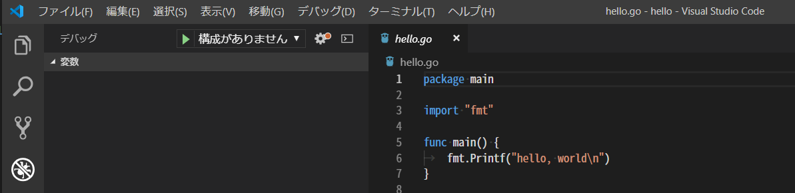
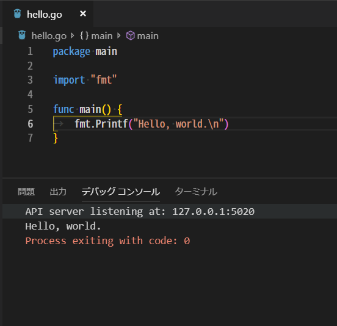
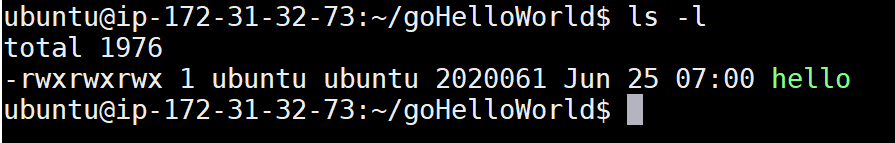

# 🔰golangをさわってみる with windows10-vscode

golangはとっても愛らしいgopherくんがマスコットキャラクターなことで有名なプログラミング言語。

そんなgolangをさわってみる。

ちなみに下記がgopherくん。


作者は[Renée French](http://reneefrench.blogspot.com/)さんでライセンスはcc3.0！

[The Go Blog](https://blog.golang.org/gopher)

## 🔰公式サイトやらリポジトリやら

- [The Go Programming Language](https://golang.org/)
- [github - golang/go](https://github.com/golang/go)

## 🔰そもそもgolangって？

- goはオープンソースでgoogleが開発しているプログラミング言語。
- unixやC言語に関わった人たちによって設計されている。
- スクリプト言語ではなくてコンパイルするやつ。（コンパイルが早いのが特徴の一つらしい）
- 仮想マシンではなくてネイティブなやつ
- 様々なOS用にクロスコンパイルするのが簡単

本資料では、windows10+vscode+vscodeのgolang拡張機能を利用してgolangをさわってみる。

## 🔰環境構築

- go1.10.2 windows/amd64
- windows10
- vscode 1.24 + vscodeのgo拡張機能(vscode-go)
- powershell 6.0.2

今回は上記環境でgolangをさわっていく。

golangをインストールするためのシステム要件としてはFreeBSD/Linux/macOS/Windowsをサポートしている。(2018年6月)

### 🔰golangのインストール

- [The Go Programming Language - Getting Started](https://golang.org/doc/install)
- [chocolatey - golang](https://chocolatey.org/packages/golang)

公式サイトのGetting Startedからインストーラーをダウンロードしてインストールするか、windowsのパッケージ管理ツールにもgolangがあるのでお好きな方法でインストールして下さい。

今回はchocolateyでインストールしてみる。


インストールされました。


`go version`でバージョンを確認してみる。


### 🔰vscodeのインストール

[VSCodeの公式サイト](https://code.visualstudio.com/)からダウンロードしてインストールして下さい。
一応、chocolateyにもパッケージあります。

### 🔰vscodeにgo拡張機能をインストール

- [visual sutido marketplatce - Go](https://marketplace.visualstudio.com/items?itemName=ms-vscode.Go)
- [Microsoft/vscode-go](https://github.com/Microsoft/vscode-go)

上記のようにvscodeのマーケットプレイスにgolang用の拡張機能が用意されています。
ちなみに提供者はMicrosoft。やっぱりMicrosoft最近こういうの力いれてますねという感じ。


vscodeのサイトにgolangについての下記のようなページがあったりもする。

[Go programming in VS Code](https://code.visualstudio.com/docs/languages/go)

golang用の拡張機能をインストールして設定すると、インテリセンスやらデバッグやらgo開発に便利な機能がvscodeで利用できるようになります。

### 🔰vscodeのgo拡張機能の設定

vscodeのgo拡張機能をインストールして、それで終了という訳ではなくいろいろと設定をしていきます。

[visual sutido marketplatce - Go](https://marketplace.visualstudio.com/items?itemName=ms-vscode.Go)のOverviewnページのHow to use this extension?に説明があるので、これを参考に作業していく。

本資料で今回行うは下記。

- GOPATHについて確認
- vscodeのgo拡張機能を利用するときの公式が薦める設定
- vscodeのgo拡張機能で利用するパッケージのインストール

#### 🔰GOPATHについて確認。 そもそもGOPATHって？

[how-to-use-this-extension](https://github.com/Microsoft/vscode-go#how-to-use-this-extension)のNOTE1に**GOPATH**うんぬんと書いてるけど、そもそも**GOPATH**ってなんだ？

golangリポジトリのwikiにGOPATHについての説明ページがあったので見てみる。

- [GOPATH](https://github.com/golang/go/wiki/GOPATH)
- [SettingGOPATH](https://github.com/golang/go/wiki/SettingGOPATH)

GOPAHTはgolangで利用する環境変数でワークスペースを指定するらしい。

Windowsの場合、下記のようにふるまうらしい。

- windowsの環境変数にGOPATHが設定されていればwindowsの環境変数の値を利用する。
- windowsの環境変数にGOPATHが設定されてない場合は、`%USERPROFILE%\go`が利用される(この動きをするのはGo 1.8かららしい)

[Print Go environment information](https://golang.org/cmd/go/#hdr-Print_Go_environment_information)のページに書いてあるように、`go env`でgoの環境変数がとれるようなので実際にどう設定されているか見てみる。

下記画像をみると今回はwindowsの環境変数にget-childitemでGOPATHが設定されていないのを確認してから、`go env GOPATH`で`%USERPROFILE%\go`が設定されていることが確認している。

- `get-childitem env:GOPATH`でwindowsの環境変数が登録されていないことを確認。
- `go env GOPATH`でデフォルト`%USERPROFILE%\go`の設定が行われていることが確認。


とりあえず現在の状態としては

- windowsの環境変数にはGOPATHはない。
- go envをみるとGOPATHのデフォルトの`%USERPROFILE%\go`が設定されている

ちなみにcmd.exeだと%USERPROFILE%でホームディレクトリですが、powershellだと$HOMEでホームディレクトリになります。

またgo拡張機能の[GOPATH in the VS Code Go extension](https://github.com/Microsoft/vscode-go/wiki/GOPATH-in-the-VS-Code-Go-extension)をみると、settings.jsonにgo.gopathが設定してあれば既存の値より優先されると書いてあります。
今回、既存の値(`%USERPROFILE%\go`)で特に問題はないので確認だけして終了。
go v1.8以前だったら、環境変数GOPATHを設定しないとまずそう？　ですがgo v1.8以上だと設定しなくてもデフォルトの値が利用されるので別段登録する必要性はなさそう？　とりあえず問題が出てきたら登録する方向で行きます。

またvscodeで明示的にGOPATHを指定したい場合はファイル->基本設定->設定で"go.gopath"の値を設定すればOK。

ちなみにvscodeでコマンドパレットで`go:current gopath`コマンドを実行すると、設定されているgopathが確認できたりします。


#### 🔰"files.autoSave"の設定をafterDelayに

[how-to-use-this-extension](https://github.com/Microsoft/vscode-go#how-to-use-this-extension)のNote2に拡張機能つかうならvscodeの自動保存の設定をafterDelayにするのおすすめ！　って書いてある。
個人的には自動保存って嫌いなんですが、公式がおすすめするのなら一度くらいは試してみようととりあえず"files.autosave":"afterDelay"に変更する。


#### 🔰"go.gocodeAutoBuild"の設定をtrueに

[how-to-use-this-extension](https://github.com/Microsoft/vscode-go#how-to-use-this-extension)のNote3にこの拡張機能ではgocodeなるものを使う、このときに"go.gocodeAutoBuild"はtrueのほうが色々と都合がほにゃららと書いてある。
とりあえずtrueに設定してみる。パフォーマンスの問題がでたらfalseにしてねだそうです。


#### 🔰Go: Install/Update toolsで拡張機能で利用するパッケージのインストール

vscodeのgo拡張機能ではいろいろなパッケージを利用しているらしい。

`go: install/update tools`でこれらのパッケージを一気にインストールしてくれるらしいのでインストールしてみる。

メニューバーの表示->コマンドパレット。もしくはctrl+shift+Pでコマンドパレットを表示して該当のコマンドを実行する。


実行するとvscodeの出力コンソールにインストールしてる経過が出力されます。少し時間がかかりますが無事にインストールSuccess。


一応、GOPATHの配下にあるbinディレクトリをみてみるといろいろとパッケージがインストールされているのがわかります。


## 🔰A Tour of Goをやってみる

公式サイトに[A Tour of Go](https://tour.golang.org/welcome/1)というチュートリアルがあるのでやってみる。

インタラクティブな画面で色々と試せてなかなか面白い。　あとgopherくんかわいい。


ありがたいことに日本語に翻訳してくれてプロジェクトもあるようですね。

[github - atotto/go-tour-jp](https://github.com/atotto/go-tour-jp)

それにしてもこのA Tour of GO。なんらかのプログラミング経験がないと少し難しいような気がします。

### 🔰A Tour of Goをローカルで動かしてみる

ちなみにGo Tourの中に書いてありますが、gotourはローカルで動かすこともできます。

goをインストールしたあとに、`go tool tour`コマンドを実行するとブラウザが起動します。`go tool`というコマンドにA Tour of GOが含まれているようですね。

もしくは、`go get golang.org/x/tour/gotour`でgotourのパッケージをダウンロードするとGOPAH配下のbinにgotour.exeができているのでこれを実行！


## 🔰とりえあずhelloworldをやる

[How to Write Go Code](https://golang.org/doc/code.html)にhelloworldがあるのでやってみる。

なんかhelloworld以前にgolangの心得っぽいのが色々と書いてるのでこれかなり重要なやつだ！

golangだとすべてのコードを一つのワークスペースで管理するのを推奨してるっぽい。

そんなワークスペースは下記のような構成になっているそうです。

dir  | description
:--- | :----------------------------
src  | contains Go source files,
pkg  | contains package objects, and
bin  | contains executable commands.

ここらへんせっかくだからgolangの風を感じながら、推奨される方法でワークスペースを管理して行きたい所。

あと**GOPATH\bin**を環境変数PATHに追加しておくと便利っぽいですね。

### 🔰サンプルプログラムを作成する

[How to Write Go Code](https://golang.org/doc/code.html)では**github.com\user**で管理する例が記載されていますが、今回はローカルでしかやるつもりはないので下記のようにsrcディレクトリの直下に**local\hello**という具合にしてみた。

下記コマンドでGOPATH\src\local\helloというディレクトリを作成  

`mkdir "$(go env GOPATH)\src\local\hello"`


作成したディレクトリ配下に下記内容で**hello.go**というファイルを作成する。

```go
package main

import "fmt"

func main() {
	fmt.Printf("Hello, world.\n")
}
```

ちなみにgolangってインデントはタブ文字が使われてるんですね。

普段、インデントってタブキーを打ったらvscodeの設定でスペース4文字とか使ってる人間なのですが、golangの風を感じながらgolangではタブ文字を使っていきます。

[Effective Go - Formatting](https://golang.org/doc/effective_go.html#formatting)に色々と書いてあります。


### 🔰サンプルプログラムをvscodeでデバック実行してみる

プログラムの作成が終わったのでvscodeでデバック実行してみます。

vscodeのデバックパネルを開くと**構成がありません**となっているので、とりあえず歯車マークを押す。

▶debug画面  


vscodeではlaunch.jsonというファイルでデバッグの設定を色々と定義できるのですが、自動でgolang用の物を生成してくれました。便利。

ざっくり説明すると、この設定(name:Launch)は現在アクティブなプログラム(${fileDirName})のデバック実行をしてくれます。

[vscode - Debugging](https://code.visualstudio.com/docs/editor/debugging)に色々と書いてあります。

▶launch.jsonが生成される。  


先程生成されたlaunch.jsonはアクティブなプログラムをデバックするものなので、hello.goプログラムのタブを選択してからLaunchになっている事を確認してデバック実行ボタンを選択。


デバックコンソール(ctrl+shit+Y)に結果が表示されます。コンソールに"Hello, world"と表示されました。



ちなみにvscodeのgo拡張機能ではgolangのデバックを行うのに、delveというデバッガを裏で使っているようです。

[github - derekparker/delve](https://github.com/derekparker/delve)

### 🔰サンプルプログラムをgo installでインストールしてみる

[Compile and install packages and dependencies](https://golang.org/cmd/go/#hdr-Compile_and_install_packages_and_dependencies)

`go install {packages}`コマンドでパッケージのインストールが行われるようです。

`go install local\hello`のように書くと、作成したプログラムをインストールしてくれる。

コマンドを実行したら特にエラーもなく終了し、**gopath/bin**配下にhello.exeがビルドされています。これを実行すると**Hello , world.**と表示されます。

今回、gopath/binは`$home/go/bin`になっているので下記のようにinvoke-expressionで実行してみる。($HOMEはpowershellでホームディレクトリを指す変数)


### 🔰サンプルプログラムをgo runでプログラム実行してみる

[Compile and run Go program](https://golang.org/cmd/go/#hdr-Compile_and_run_Go_program)をみると。

`go run {gofilesPath}`のコマンドで実行できるようなので一応、先程作成したhello.goを実行してみる。


実行できました、`go run`コマンドでは対象のプログラムを一時ファイルとしてコンパイルして実行してくれます。

### 🔰サンプルプログラムをgo buildでビルドしてみる

[Compile packages and dependencies](https://golang.org/cmd/go/#hdr-Compile_packages_and_dependencies)

`go build {packages}`のコマンドでビルドできるようなので、先程作成したhelloworldをビルドして実行してみる。

`go build {packages}`でビルドして、生成されたhello.exeを実行。


※go buildするときに**go build - Access is denied**なエラーが出ることがありました。管理者実行したりなんだりしていたら自然とエラーがでなくなったので原因不明……なにか裏で動いていただろうか……


## 🔰ライブラリを作成して利用してみる

[Your first library](https://golang.org/doc/code.html#Library)にあるstringを反転するライブラリを作成して利用する例を試してみる。

helloworldのときと同様にlocalな場所にディレクトリを作成

下記コマンドでGOPATH\src\local\stringutilというディレクトリを作成  

`mkdir "$(go env GOPATH)\src\local\stringutil"`

作成したディレクトリに下記内容でreverse.goという名前のファイルを作成する。

```go
// Package stringutil contains utility functions for working with strings.
package stringutil

// Reverse returns its argument string reversed rune-wise left to right.
func Reverse(s string) string {
	r := []rune(s)
	for i, j := 0, len(r)-1; i < len(r)/2; i, j = i+1, j-1 {
		r[i], r[j] = r[j], r[i]
	}
	return string(r)
}
```

`go build local\stringutil`でビルドする。

先程はフルパスを指定してbuildを試してみましたが、こういう形式でもOKっぽい。

先程作成した**local\hello\hello.go**のファイルを下記のように書き換える。

```go
package main

import (
	"fmt"
	"local/stringutil"
)

func main() {
	fmt.Printf(stringutil.Reverse("!oG ,olleH"))
}
```

go installでビルドする。生成されたhello.exeを実行する。

`go install local\hello`


stringutilをimportしてReverseを実行して"!oG ,olleH"という文字列を反転してHello, Go!という文字列が表示されている事がわかります。

## 🔰パッケージ名について

goソースファイルの最初の一文は

`package name`

nameは実行可能コマンドの場合は常に**main**。

それ以外の場合、nameはインポートするパスの最後の要素である必要があるようです。

**local/stringutil**ならば最後の要素の**stringutil**

詳細については[Package names](https://golang.org/doc/effective_go.html#names)を参照。

## 🔰サンプルプログラムでテストパッケージ(testing)を利用してみる

golangでテストフレームパッケージを利用する場合は、

- ファイル末尾に_test.go
- functionの名前は銭湯にTestを付与
- functionの引数は(t *testing.T)

である必要があります。

ここでは先程作成した、**local\stringutil**のテストコードを作成してテストを実施してみる。

下記内容で**local\stringutil\reverse_test.go**というファイルを作成する。

テストパッケージ(testing)の詳細については下記参照

- [Package testing](https://golang.org/pkg/testing/)
- [Test packages](https://golang.org/cmd/go/#hdr-Test_packages)

```go
package stringutil

import "testing"

func TestReverse(t *testing.T) {
	cases := []struct {
		in, want string
	}{
		{"Hello, world", "dlrow ,olleH"},
		{"Hello, 世界", "界世 ,olleH"},
		{"", ""},
	}
	for _, c := range cases {
		got := Reverse(c.in)
		if got != c.want {
			t.Errorf("Reverse(%q) == %q, want %q", c.in, got, c.want)
		}
	}
}
```

上記のテストプログラムはお約束として

- ファイル名は末尾に_test.goを付与したreverse_test.go。
- testingパッケージをインポート。
- functionは先頭にTestを付与したTestReverse。

中身のロジックとしては、

casesという想定するinputとwantの組み合わせを記述した構造を定義

casesは下記のような組み合わせの構造になっている

input          | want
:------------- | :-------------
"Hello, world" | "dlrow ,olleH"
"Hello, 世界"  | "界世 ,olleH"
""             | ""

この構造をfor文でループさせてReverse関数にinを渡して結果gotを取得。
取得できたgotと期待するwantが一致する場合はOK。一致しない場合はt.Errorfでエラーを出力させる。

`go test {package}`コマンドでテストを実行

`go test local/stringutil`


## 🔰クロスコンパイルしてみる

golangではクロスコンパイルが手軽に行えてすごいらしいので試してみる。

今回はwindowsOS上でlinux amd64用のバイナリをコンパイルしてみて、生成されたバイナリファイルをubuntuで動かしてみる。

クロスコンパイルの詳細については下記を参照

- [Optional environment variables](https://golang.org/doc/install/source#environment)

今回は下記コマンドでlinux amd64用のバイナリを生成する。

```powershell
$env:GOOS="linux";$env:GOARCH="amd64"; go install local\hello
```

上記のコマンドを実行すると、GOPATH\bin\linux_amd64\helloというファイルが生成されました。
これを、ubuntuにもっていって実行する。

とりあえずunbutu上の/home/ubuntu/goHelloWorld/helloという場所にバイナリファイルをおいてみました。



実行してみました。


Hello, Go!と表示されました！(改行コード入れてなかったからか、改行されてないですけど)

## 🔰総評

goopherくんかわいい……尊い……

あと基礎的なgolangの文法についても記載しようかと思いましたが、長くなりそうなので別記事にします。
