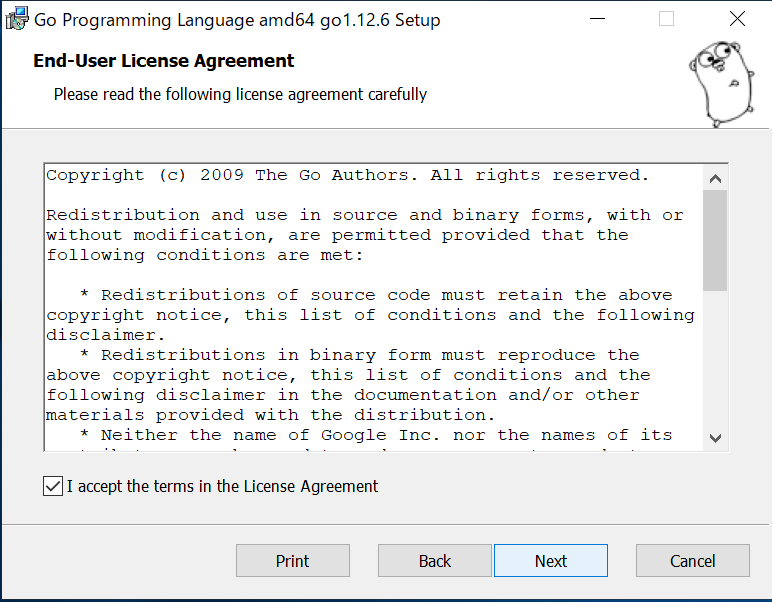
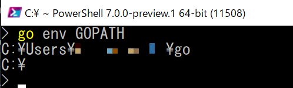
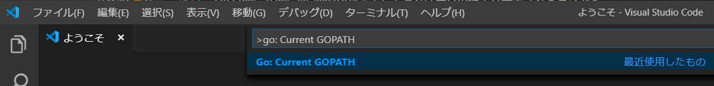
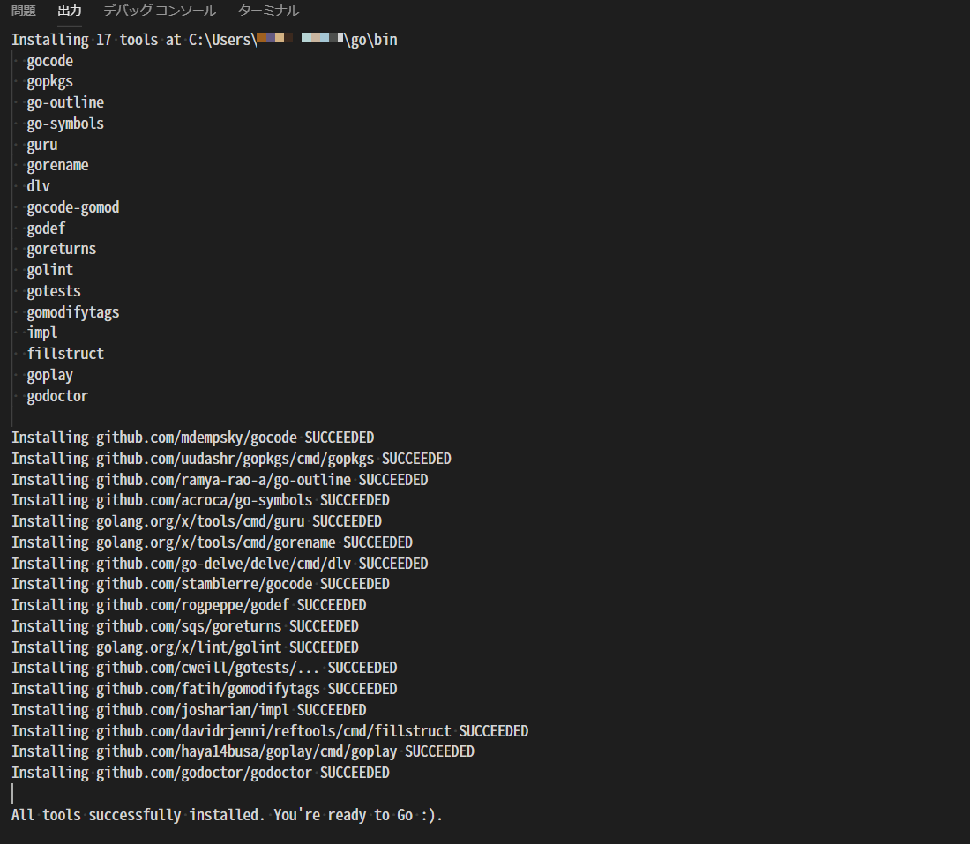
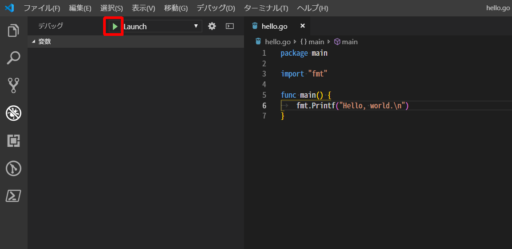
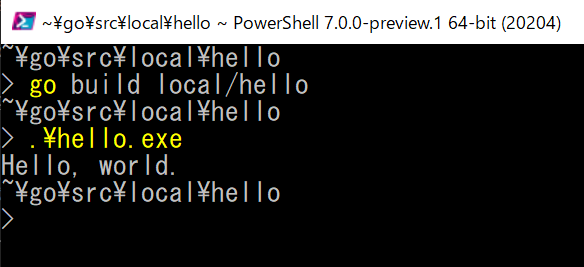

# 🔰golangをさわってみる with windows10-vscode

golangはとっても愛らしいgopherくんがマスコットキャラクターなことで有名なプログラミング言語。

今回はそんなgolangをさわってみる。

ちなみに下記がgopherくん。


作者は[Renée French](http://reneefrench.blogspot.com/)さんでライセンスはcc3.0！

[The Go Blog - gopher](https://blog.golang.org/gopher)

## 🔰公式サイトやらリポジトリやら

- [The Go Programming Language](https://golang.org/)
- [github - golang/go](https://github.com/golang/go)

## 🔰そもそもgolangって？

- golangはオープンソースでgoogleが開発しているプログラミング言語。
- unixやC言語に関わった人たちによって設計されている。
- スクリプト言語ではなくてコンパイルするやつ
- 仮想マシンではなくてネイティブなやつ
- 様々なOS用にクロスコンパイルするのが簡単

## 🔰環境構築

本資料ではWindows 10+vscode+vscodeのgolang拡張機能を利用してgolangをさわってみる。

- go1.12.6.windows-amd64
- windows10
- vscode 1.36.1
- vscodeのgo拡張機能 GO(ms-vscode.go)

### 🔰golangのインストール

- [The Go Programming Language - Getting Started](https://golang.org/doc/install)

公式サイトのGetting Startedに各OS環境での手順が記載されているので、この中の[Windows](https://golang.org/doc/install#windows)を参考に進めていく。
※Windowsなパッケージ管理ツールのchocolateyにもgolangのパッケージがあるので、こちらでインストールするのもありかと思います。

WindowsではMSIインストーラかzipアーカイブからインストール手法があるようなので、今回はMSIインストーラを選択。

なおgolangをインストールするシステム要件は下記に記載があります。

[System requirements](https://golang.org/doc/install#requirements)

[Download](https://golang.org/dl/)

ダウンロードページからMicrosoft Windows用のインストーラを取得して実行。





インストール完了！ デフォルトでは`c:\go`にインストールされるようです。

[Windows - MSI installer](https://golang.org/doc/install#windows)に下記のような記載があるので、環境変数PATHを確認してみる。

>The installer should put the c:\Go\bin directory in your PATH environment variable. You may need to restart any open command prompts for the change to take effect.

確認した所、環境変数`PATH`と`GOPATH`がインストーラによって登録されたようです。

- ユーザ環境変数PATHには`%USERPROFILE%\go\bin`
- ユーザ環境変数GOPATHには`%USERPROFILE%\go`
- システム環境変数PATHには`C:\Go\bin`

### 🔰Test your installation

golangの[Test your installation](https://golang.org/doc/install#testing)があるのでやってみる。

サンプルでは`%USERPROFILE%\go\src\hello`をワークディレクトリとして利用するのでまずこのディレクトリを作成し、下記サンプルコードをhello.goというファイル名で保存する。

```go
package main

import "fmt"

func main() {
	fmt.Printf("hello, world\n")
}

```

hello.goというソースファイルを用意したら、作成したディレクトリに移動したビルドして実行。（下記はPowerShell)


hello, worldと表示が帰ってきたので、うまくインストールできたようです。

### 🔰vscodeのインストール

[VSCodeの公式サイト](https://code.visualstudio.com/)からダウンロードしてインストールして下さい。
一応、chocolateyにもパッケージあります。

### 🔰vscodeにgo拡張機能をインストール

- [visual sutido marketplatce - Go](https://marketplace.visualstudio.com/items?itemName=ms-vscode.Go)
- [Microsoft/vscode-go](https://github.com/Microsoft/vscode-go)

vscodeのマーケットプレイスにgolang用の拡張機能が用意されています。
ちなみに提供者はMicrosoft。Microsoftなかなか力をいれてますね。


vscodeのサイトにgolangについての下記のようなページがあったりもする。

[Go programming in VS Code](https://code.visualstudio.com/docs/languages/go)

golang用の拡張機能をインストールして設定すると、インテリセンスやデバッグなどなどgo開発に便利な機能がvscodeで利用できるようになります。

### 🔰vscodeのgo拡張機能の設定

vscodeのgo拡張機能をインストールしたので設定をします。

[visual sutido marketplatce - Go](https://marketplace.visualstudio.com/items?itemName=ms-vscode.Go)のOverviewnページのHow to use this extension?に説明があるので、これを参考に作業していく。

本資料で今回行うは下記。

- GOPATHについて確認
- vscodeのgo拡張機能を利用するときの公式が薦める設定
- vscodeのgo拡張機能で利用するパッケージのインストール

#### 🔰GOPATHについて確認。 そもそもGOPATHって？

[how-to-use-this-extension](https://github.com/Microsoft/vscode-go#how-to-use-this-extension)のNOTE1に**GOPATH**うんぬんと書いてるけど、そもそも**GOPATH**ってなんだ？

golangリポジトリのwikiにGOPATHについての説明ページがあったので見てみる。

- [GOPATH](https://github.com/golang/go/wiki/GOPATH)
- [SettingGOPATH](https://github.com/golang/go/wiki/SettingGOPATH)

GOPAHTはgolangで利用する環境変数になり、ワークスペースを指定するようです。

Windowsの場合、下記のようにふるまうらしい。

- windowsの環境変数にGOPATHが設定されていればwindowsの環境変数の値を利用する。
- windowsの環境変数にGOPATHが設定されてない場合は、`%USERPROFILE%\go`（この動きをするのはGo 1.8 かららしい）

[Print Go environment information](https://golang.org/cmd/go/#hdr-Print_Go_environment_information)のページを見ると、`go env`コマンドで利用している環境変数がとれるようなので確認してみる。



インストーラから登録されたとユーザ環境変数GOPATHが参照できました。
なお、ためしにユーザ環境変数のGOPATHを削除してから`go env GOPATH`を実行して見た所、ドキュメントの通り`%USERPROFILE%\go`を利用していました。

vscodeのgolang拡張機能でのGOPATHの扱いについては下記に記載があり。

- [GOPATH in the VS Code Go extension](https://github.com/Microsoft/vscode-go/wiki/GOPATH-in-the-VS-Code-Go-extension)

settings.jsonにgo.gopathが設定してあれば既存の値より優先されるそうです。

setting.jsonのgo.gopathを設定する場合は、vscodeのファイル=>基本設定=>設定で"go.gopath"の値を設定すればOK。

ちなみにvscodeのコマンドパレットで`go:current gopath`コマンドを実行すると、設定されているgopathが確認できたりします。



golang バージョン1.8未満のだったら、環境変数GOPATHを設定しないとまずそう？　ですがgolang バージョン1.8以上だと設定がなくてもデフォルトの値が利用されるのであまりきにしなくてもよさそう。
（更に言えばインストーラからインストールすると今現在は環境変数を追加してくれるっぽい）

#### 🔰"files.autoSave"の設定をafterDelayに

昔は[how-to-use-this-extension](https://github.com/Microsoft/vscode-go#how-to-use-this-extension)のNote2に下記のような記載があり。

```
Note 2: Users may want to consider turning Auto Save on in Visual Studio Code ("files.autoSave": "afterDelay") when using this extension. Many of the Go tools work only on saved files, and error reporting will be more interactive with Auto Save turned on. If you do turn Auto Save on, then the format-on-save feature will be turned off.
```

"files.autosave":"afterDelay"してみたのですが、今現在は下記のような記述になっており、この設定を行うかどうかは少し悩む。

```
Note 2: The Format on save feature has a timeout of 750ms after which the formatting is aborted. You can change this timeout using the setting editor.formatOnSaveTimeout. This feature gets disabled when you have enabled the Auto Save feature in Visual Studio Code.
```

#### 🔰"go.gocodeAutoBuild"の設定をtrueに

[how-to-use-this-extension](https://github.com/Microsoft/vscode-go#how-to-use-this-extension)のNote3にこの拡張機能ではgocodeなるものを使う、このときに"go.gocodeAutoBuild"はtrueのほうが色々と都合がほにゃららと書いてある。
とりあえずtrueに設定してみる。パフォーマンスの問題がでたらfalseにしてねだそうです。


#### 🔰Go: Install/Update toolsで拡張機能で利用するパッケージのインストール

vscodeのgo拡張機能ではいろいろなパッケージを利用しているらしい。

`go: install/update tools`でこれらのパッケージを一気にインストールしてくれるらしいのでインストールしてみる。

表示からコマンドパレットを選択。
もしくはctrl+shift+Pでコマンドパレットを表示して該当のコマンドを実行する。


とりあえず全部選択。


実行するとvscodeの出力コンソールにインストールしてる経過が出力されます。少し時間がかかりますが無事にインストールSuccess。



一応、GOPATHの配下にあるbinディレクトリをみてみるといろいろとパッケージがインストールされているのが確認できます。

## 🔰A Tour of Goをやってみる

公式サイトに[A Tour of Go](https://tour.golang.org/welcome/1)というチュートリアルがあるのでやってみる。

インタラクティブな画面で色々と試せてなかなか面白い。　あとgopherくんかわいい。


日本語に翻訳するプロジェクトもあるようですね。

[github - atotto/go-tour-jp](https://github.com/atotto/go-tour-jp)

それにしてもこのA Tour of GO。なんらかのプログラミング経験がないと少し難しいような気がします。

### 🔰A Tour of Goをローカルで動かしてみる

Go Tourの中に書いてありますが、gotourはローカルで動かすこともできます。

`go get golang.org/x/tour`でgotourのパッケージをダウンロードするとGOPAH配下のbinにtour.exeができるのでこれを実行！


## 🔰とりえあずhelloworldをやる

[How to Write Go Code](https://golang.org/doc/code.html)にhelloworldがあるのでやってみる。

このページ、helloworld以前にgolangの心得っぽいのが色々と書いてるのでこれかなり重要なやつだ！

golangではすべてのコードを1つのワークスペースで管理するのを推奨してるっぽい。

そんなワークスペースは下記のような構成。

dir  | description
:--- | :----------------------------
src  | contains Go source files,
pkg  | contains package objects, and
bin  | contains executable commands.

せっかくだからgolangの風を感じながら、推奨される方法でワークスペースを管理してみます。

### 🔰サンプルプログラムを作成する

[How to Write Go Code](https://golang.org/doc/code.html)では`github.com\user`で管理する例が記載されていますが、今回はローカルでしかやるつもりはないので下記のようにsrcディレクトリの直下に`local\hello`という具合。

やることは、Test your installationでやった内容とほぼ一緒。

`%GOPATH%\src\local\hello`というディレクトリを作成  

作成したディレクトリ配下に下記内容で**hello.go**というファイルを作成する。

```go
package main

import "fmt"

func main() {
	fmt.Printf("Hello, world.\n")
}
```

ちなみにgolangってインデントはタブ文字が使われてるんですね。

普段、インデントってタブキーを打ったらvscodeの設定でスペース4文字とか使ってる人間なのですが、golangの風を感じながらgolangではタブ文字を使っていきます。

[Effective Go - Formatting](https://golang.org/doc/effective_go.html#formatting)に色々と書いてあります。

### 🔰サンプルプログラムをvscodeでデバック実行してみる

プログラムの作成が終わったのでvscodeでデバック実行してみます。

vscodeのデバックパネルを開くと**構成がありません**となっているので、とりあえず歯車マークを押す。

▶debug画面  


vscodeではlaunch.jsonというファイルでデバッグの設定を定義できるのですが、golang用のlaunch.jsonを自動で生成してくれました。便利。

▶launch.jsonが生成される。  


ざっくり説明すると設定（name:Launch）は現在アクティブなプログラム（${fileDirname}）のデバック実行をしてくれます。

lunch.jsonについては下記に色々と記載があります。

- [vscode - Debugging](https://code.visualstudio.com/docs/editor/debugging)

先程生成されたlaunch.jsonはアクティブなプログラムをデバックするものなので、hello.goプログラムのタブを選択してからLaunchになっている事を確認してデバック実行ボタンを選択。



デバックコンソール（ctrl+shit+Y）に結果、"Hello, world"が表示されました。


ちなみにvscodeのgo拡張機能ではgolangのデバックを行うのに、delveというデバッガを裏で使っているようです。

[github - derekparker/delve](https://github.com/derekparker/delve)

### 🔰サンプルプログラムをgo installでインストールしてみる

[Compile and install packages and dependencies](https://golang.org/cmd/go/#hdr-Compile_and_install_packages_and_dependencies)

`go install {packages}`コマンドでパッケージのインストールが行われるようです。

`go install local\hello`のように書くと、作成したプログラムをインストールしてくれる。

コマンドを実行したら特にエラーもなく終了し、**gopath/bin**配下にhello.exeがビルドされています。これを実行すると**Hello , world.**と表示されます。

今回、gopath/binは`$home/go/bin`になっているので下記のようにinvoke-expressionで実行してみる。（$HOMEはpowershellでホームディレクトリを指す変数）


### 🔰サンプルプログラムをgo runでプログラム実行してみる

`go run`でパッケージをビルドして実行します。

[Compile and run Go program](https://golang.org/cmd/go/#hdr-Compile_and_run_Go_program)

`go run [build flags] [-exec xprog] package [arguments...]`

`go run {packages}`のコマンドで、先程作成したhello.goを実行してみる。


実行できました、`go run`コマンドでは対象のプログラムを一時ファイルとしてコンパイルして実行してくれます。

### 🔰サンプルプログラムをgo buildでビルドしてみる

`go build`でパッケージをビルドします。

[Compile packages and dependencies](https://golang.org/cmd/go/#hdr-Compile_packages_and_dependencies)

`go build [-o output] [-i] [build flags] [packages]`

`go build {packages}`のコマンドでビルドできる。なお`-o`をつけない場合はワークディレクトリにビルドしたバイナリが出力されます。

`go build {packages}`でビルドして、生成されたhello.exeを実行。



## 🔰ライブラリを作成して利用してみる

[Your first library](https://golang.org/doc/code.html#Library)にあるstringを反転するライブラリを作成して利用する例を試してみる。

%GOPATH%\src\local\stringutilにディレクトリを作成

作成したディレクトリに下記内容でreverse.goという名前のファイルを作成する。

```go
// Package stringutil contains utility functions for working with strings.
package stringutil

// Reverse returns its argument string reversed rune-wise left to right.
func Reverse(s string) string {
	r := []rune(s)
	for i, j := 0, len(r)-1; i < len(r)/2; i, j = i+1, j-1 {
		r[i], r[j] = r[j], r[i]
	}
	return string(r)
}
```

`go build local\stringutil`でビルドする。

先程作成した**local\hello\hello.go**のファイルを下記のように書き換える。

```go
package main

import (
	"fmt"
	"local/stringutil"
)

func main() {
	fmt.Printf(stringutil.Reverse("!oG ,olleH"))
}
```

go installでビルドする。生成されたhello.exeを実行する。

`go install local\hello`


stringutilをimportしてReverseを実行して"!oG ,olleH"という文字列を反転してHello, Go!という文字列が表示されている事がわかります。

## 🔰パッケージ名について

goソースファイルの最初の一文は

`package name`

nameは実行可能コマンドの場合は常に**main**。

それ以外の場合、nameはインポートするパスの最後の要素である必要があるようです。

**local/stringutil**ならば最後の要素の**stringutil**

詳細については[Package names](https://golang.org/doc/effective_go.html#names)を参照。

## 🔰サンプルプログラムでテストパッケージ（testing）を利用してみる

golangでテストフレームパッケージを利用する場合は、

- ファイル末尾に_test.go
- functionの名前は銭湯にTestを付与
- functionの引数は（t *testing.T）

である必要があります。

ここでは先程作成した、**local\stringutil**のテストコードを作成してテストを実施してみる。

下記内容で**local\stringutil\reverse_test.go**というファイルを作成する。

テストパッケージ（testing）の詳細については下記参照

- [Package testing](https://golang.org/pkg/testing/)
- [Test packages](https://golang.org/cmd/go/#hdr-Test_packages)

```go
package stringutil

import "testing"

func TestReverse(t *testing.T) {
	cases := []struct {
		in, want string
	}{
		{"Hello, world", "dlrow ,olleH"},
		{"Hello, 世界", "界世 ,olleH"},
		{"", ""},
	}
	for _, c := range cases {
		got := Reverse(c.in)
		if got != c.want {
			t.Errorf("Reverse(%q) == %q, want %q", c.in, got, c.want)
		}
	}
}
```

上記のテストプログラムはお約束として

- ファイル名は末尾に_test.goを付与したreverse_test.go。
- testingパッケージをインポート。
- functionは先頭にTestを付与したTestReverse。

中身のロジックとしては、

casesという想定するinputとwantの組み合わせを記述した構造を定義

casesは下記のような組み合わせの構造になっている

input          | want
:------------- | :-------------
"Hello, world" | "dlrow ,olleH"
"Hello, 世界"  | "界世 ,olleH"
""             | ""

この構造をfor文でループさせてReverse関数にinを渡して結果gotを取得。
取得できたgotと期待するwantが一致する場合はOK。一致しない場合はt.Errorfでエラーを出力させる。

`go test {package}`コマンドでテストを実行

`go test local/stringutil`


## 🔰クロスコンパイルしてみる

golangではクロスコンパイルが手軽に行えてすごいらしいので試してみる。

今回はwindowsOS上でlinux amd64用のバイナリをコンパイルしてみて、生成されたバイナリファイルをubuntuで動かしてみる。

クロスコンパイルの詳細については下記を参照

- [Optional environment variables](https://golang.org/doc/install/source#environment)

今回は下記コマンドでlinux amd64用のバイナリを生成する。

```powershell
$env:GOOS="linux";$env:GOARCH="amd64"; go install local\hello
```

上記のコマンドを実行すると、GOPATH\bin\linux_amd64\helloというファイルが生成されました。
これを、ubuntuにもっていって実行する。

とりあえずunbutu上の/home/ubuntu/goHelloWorld/helloという場所にバイナリファイルをおいてみました。


実行してみました。


Hello, Go!と表示されました！（改行コード入れてなかったからか、改行されてないですけど）

## 🔰総評

goopherくんかわいい……尊い……

あと基礎的なgolangの文法についても記載しようかと思いましたが、長くなりそうなので別記事にします。
